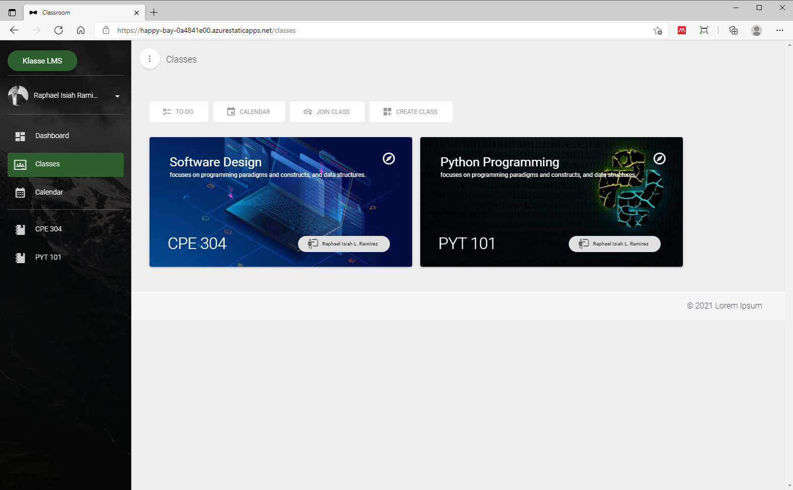
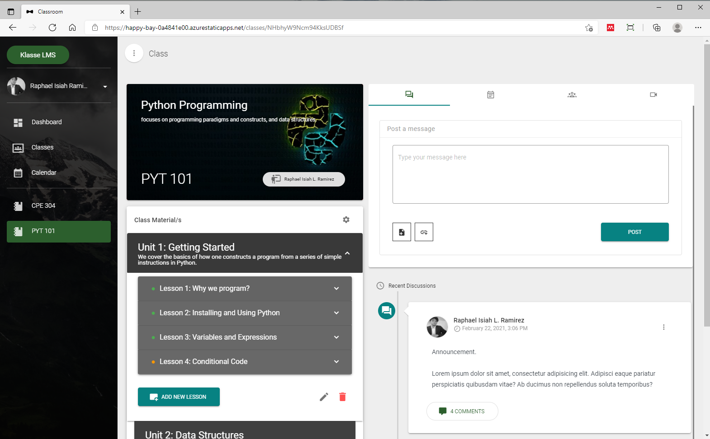
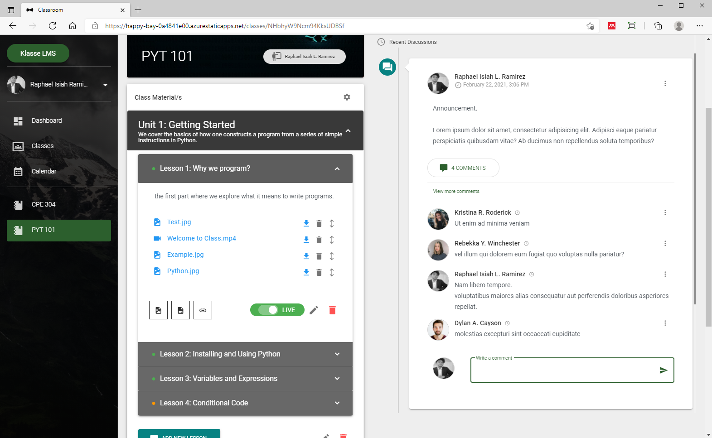

# Klasse Online Classroom

The Klasse Online Classroom is a web-based learning management system intended to be used by educators and learners. The system will provide an online platform for educators to manage their teaching files and resources. The goal of this project is to create a complete platform that facilitates online learning.

## Technologies
Project is created with:
* HTML, CSS and JavaScript
* Vue JS
* Vuetify
* TypeScript
* Google Firestore

## Developed by
Raphael Isiah L. Ramirez <br />
Hanz Josemer L. Cruz <br />
Hirold B. Bartolay <br />
Jeff Andrei M. Lacerna <br />

## Project Status
The project is still being developed.

## URL
This project utilizes Azure CI/CD pipeline.
https://happy-bay-0a4841e00.azurestaticapps.net

_Note: The project is being developed in a desktop-first approach. Using a mobile device to view this project is not recommended yet._

## Setup
To run this project, install it locally using npm:
```
npm install
```
## Compiles and hot-reloads for development
```
npm run serve
```
## Project Screenshots




